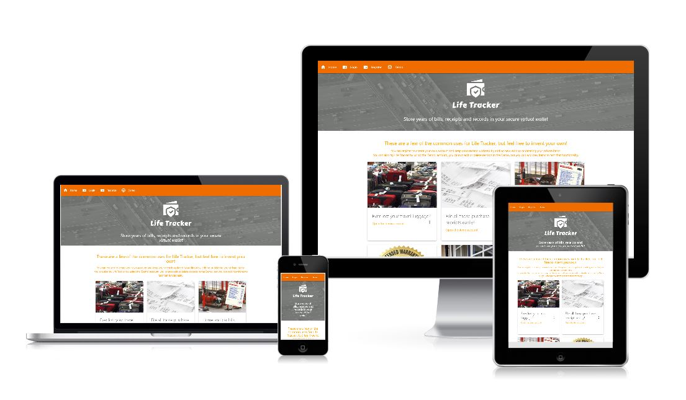

# Life Tracker

A database connected system to allow authenticated users to record items and tasks, each with an expiry date.  These tasks are presented to the user in descending expiry order.

On a recent overseas holiday the airline lost my luggage, this was never recovered.  I was able to start a claims process with the airline and my own travel insurance, however
quickly discovered that both organisations insist on submitted receipts for all items (mostly clothing) lost in my luggage.

I don't know about you, but I couldn't find receipts for socks, T shirts etc that were bought years previously.  This is why the Life Tracker app was invented!

Created as a milestone project within my [Code Institute - Full stack web developer course](https://codeinstitute.net/full-stack-software-development-diploma-uk) course, the website demonstrates an interactive front-end.

## UX

Wireframes were produced in Balsamiq to display the desired look on various [devices](static/media/images/readme/wireframes.pdf) 

User stories guided the design and functionality of the system

- As someone who insures possessions I want a (permanent) record of when items were purchased
- As someone who buys products with extended warranties I want to ensure value for money
- As a user I want a hosted solution to allow simple task lists across multiple electronic devices
- As a user I only want to see the most immediate items that need attention
- As a user I don't want to keep track of paper receipts
- I want to see a chronolocigal listing of upcoming events that need action

It is important for this application that users can logon and review upcoming items and add new items using a small display mobile phone while away from home.  The perhaps using a larger device display at home when time allows.

## Features

Dynamic navigation menu that is always displayed, even on small devices.  Options change dynamically as a user authenticates with the application.

Hero image and text is displayed on all pages (from base.html) to provide a consistent look and feel.

On many applications users are not able to see data or how the system works before they have registered for an account and authenticated.  Life Tracker has a one button 'Demo Account' that will present the user with read-only sample data.  Demo users can add new tasks to the demo account

The system presents a Materialize tab control with different task lists in each, one for recurring items and a second for items that don't repeat.  Both lists are presented in chronilogical order.

Authentication is in place and registered users will only see their own items, they can edit all properties and delete items.  Deleted items are actually hidden not physically deleted.

All data is held in a dedicated MongoDB document database.

### Features Left to Implement

A future attribute of the system is to be able to upload images associated with each task, like a mobile phone picture of a purchase receipt or attach a PDF of an extended warranty offer. 

The original wireframes show a basic dashboard of upcoming items and sum of expected costs in various time-frames, this would be a nice addition.

Its not essential for functionality but it would be sensible to add a search items feature.

The application will need to be able to permanently delete items at some point, this might be 6 months after being deleted by the user who created it.  Alternatively 'deleted items' could be made visible to users who could then delete items from the database.

## Technologies Used

- [html5](http://www.w3.org/html)
Building blocks of this site

- [CSS3](https://www.w3.org/Style/CSS/)
A simple mechanism for adding style (e.g., fonts, colors, spacing) to Web documents.

- [Javascript](https://www.w3.org/wiki/The_web_standards_model_-_HTML_CSS_and_JavaScript#JavaScript_.E2.80.94_adding_behaviour_to_web_pages)
Adding behaviour to web pages in particular building dynamic arrays of user chosen data to display in charts

- [Python](https://https://www.python.org/)
Python is a programming language that lets you work quickly and integrate systems more effectively

- [Materialize CSS](https://materializecss.com//)
Materialize CSS is an open source, mobile first toolkit for developing with HTML, CSS, and JS.

- [JQuery](https://api.jquery.com/)
The project uses JQuery to simplify DOM manipulation.

- [Gitpod](https://gitpod.io/)
Used as the primary IDE and to push committed changes back to Github

- [Github](https://github.com/)
On-line repository for all resources related to the finished site

- [Heroku](https://heroku.com/)
Used to host the finished site

- [Images](https://tinyjpg.com/)
The landing page serves 7 larger images, these have been optimised for file size to aid responsive loading of the home page.

Additional Python components were added through the PIP install facility, the final list of components is;

Package        Version
-------------- -------
blessed        1.17.12
click          7.1.2
cssselect      1.1.0
dnspython      2.0.0
Flask          1.1.2
Flask-PyMongo  2.3.0
flyingcircus   0.1.3.2
itsdangerous   1.1.0
lxml           4.6.2
pip            21.0
pymongo        3.11.2
setuptools-scm 5.0.1
Werkzeug       1.0.1

Heroku requires a 'requirements.txt' file so that it knows which Python dependencies to be loaded for the build, the final file is;

blessed==1.17.12
click==7.1.2
dnspython==2.0.0
Flask==1.1.2
Flask-PyMongo==2.3.0
flyingcircus==0.1.3.2
itsdangerous==1.1.0
pymongo==3.11.2
setuptools-scm==5.0.1
Werkzeug==1.0.1
python-dateutil==2.8.1

- [Database](https://cloud.mongodb.com/)
Document type database is utilised with 2 Collections, one for [Users](static/media/images/readme/users.jpg)
And one for [item](static/media/images/readme/items.jpg) attributes

## Testing

CDN mechanisms were used to leverage functionality from external resources, all have been updated to the latest version available from their authors.  

Note that Font-Awesome was used for social media icons as these were not available in the Materialize icons list, 

The latest Font-Awesome version is 5.15.1 but this refused to operate correctly, so the system is currently using 4.7.0

Manual testing was carried out on a variety of modern browsers, operating systems and devices of several sizes, testing revealed issues with overflow at small resolutions these issues have been fixed in the live version.  

All navbar (menu) links and in page navigation works as designed.  

Authentication (registration and logon) functionality was fully tested and working as designed.

The size of all images were checked with 300kb each being an upper limit, the largest file used is 210kb with most being less than half of that.

The html and css were validated on [W3](https://validator.w3.org/nu/) however many [errors](static/media/images/readme/errors.jpg) were identified as the result of using [Jinja2](https://pypi.org/project/Jinja2/) and [MaterialiseCSS](https://materializecss.com/)

The application logic, routing and MongoDB interaction, written in Python was checked at [PEP8-Online](http://pep8online.com/), quite a few line length and white space errors were detected, all have now been [resolved](static/media/images/readme/pep8.jpg)

Javscript is used to initialise some Materialize controls and on several html templates for client side logic and page specific functionality.

For each of the user stories, specific tests were carried out:

- As someone who insures possessions I want a (permanent) record of when items were purchased
    * The system will deliver a record of every item tracked

- As someone who buys products with extended warranties I want to ensure value for money
    * Within the warranties tab each item will appear higher up the list as it approaches it's expiry date, the user can then remove this item from the list when thay are happy that the warranty has been satidfied

- As a user I want a hosted solution to allow simple task lists across multiple electronic devices
    * The system has been tested on a selection of devices from older Samsung mobile devices, to Applie iPad tablets and Windows 10 desktop PCs

- As a user I only want to see the most immediate items that need attention
    * The default presentation order of 'expiring first' at the top of the list means only items requiring immediate attention are seen, though a user can scroll to see items further in the future

- As a user I don't want to keep track of paper receipts
    * The application does not yet enable the on-line storage of images of paper receipts, it is setup to be able to do this in the future but the work involved was determined to be outside the scope of an MS3 project.  However the user can still take a photo of any receipt as they enter a new item

- I want to see a chronolocigal listing of upcoming events that need action
    * The system will deliver this and in addition if the item recurs like annual tasks, the user can reset the expiry date for next year and that item will be immediately chronologically dropped down the action list

## Deployment

The code repository resides in [Github](https://github.com/johnmiller1963/life-tracker) and the master repository is hosted on [Heroku](https://life-tracker-system.herokuapp.com/).  

### **How to deploy to Github**

1. Open the Github repository from the link above
2. Click on 'Settings' to the far right in navigation menu below the repository name.
3. Scroll down to 'GitHub Pages' and select 'master branch' as the source.
4. Click save.
5. The link to the site hosted on GitHub Pages should appear at the top of the section.

### **How to clone this repository in order to run the code locally on your machine**

1. Open the Github repository from the link above
2. Click "Clone or Download".
3. Click the "copy" icon.
4. Open Terminal in your local IDE.
5. Change your current working directory to where you want the cloned directory to be made.
6. Type `$ git clone` and then paste the URL you copied earlier.
   `git clone https://github.com/johnmiller1963/life-tracker`
7. When you press enter your local clone will be ready.

### **How to setup this repository in order to be hosted on Heroku**

1. In your IDE create a requirements.txt via the terminal using 'pip3 freeze > requirements.txt'.
2. In your IDE Create a Procfile via the console using 'echo web: python app.py > Procfile'.
3. Create a .gitignore file in the root directory and add the env.py file to avoid it being pushed to GitHub.
4. Creat a new application using the Heroku dashboard, each application name must be unique, so for example you cannot use 'Life-Tracker-System'
5. The Heroku wizard will guide you to select the source files, select the Github repository for the source, select 'Master' if you always want the latest code version to be shown via Heroku
6. Go to settings tab, click on 'reveal config vars' and add config vars such as IP (0.0.0.0), PORT (5000), MongoDB Name, MongoDB URI (URL with DB name and password).
7. Each 'push' within Github will be picked up automatically by Heroku and 10 minutes later the latest version will be available on the Heroku application path.

### **Running the application locally using Gitpod**

1. Clone the repository as outlined above and upload it to GitPod.
2. Install the necessary libraries specified in the requirements.txt.
3. Set your environment variables by creating and adding them into a env.py file.
4. Create a .gitignore file in the root directory and add the env.py file to avoid it being pushed to GitHub.
5. Import the env.py file into the app.py file.
6. Run the application.

## Credits

Most credit must go to Code Institute as an entity.  Although this will be my last Milestone project as I have run out of time on the course, The Code Institute has been great giving me an extension to get this far.

Though I will not gain this diploma, I have gained even more by learning the modern building blocks of web developement and equally important I have gained curiosity to go further on my own.
